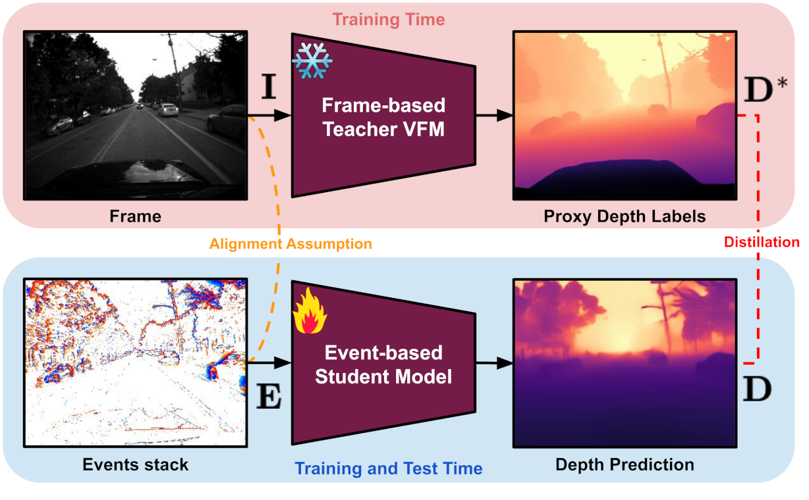

<h1 align="center" style="border-bottom: 0;"> Depth AnyEvent: A Cross-Modal Distillation Paradigm for Event-Based Monocular Depth Estimation (ICCV 2025)</h1> 

<hr>

:rotating_light: This repository will contain download links to our evaluation code, and trained deep models of our work  "**Depth AnyEvent: A Cross-Modal Distillation Paradigm for Event-Based Monocular Depth Estimation**",  [ICCV 2025](#)
 
by [Luca Bartolomei](https://bartn8.github.io/)<sup>1,2</sup>, [Enrico Mannocci](https://noce99.github.io/)<sup>2</sup>, [Fabio Tosi](https://fabiotosi92.github.io/)<sup>2</sup>, [Matteo Poggi](https://mattpoggi.github.io/)<sup>1,2</sup>, and [Stefano Mattoccia](https://stefanomattoccia.github.io/)<sup>1,2</sup>

Advanced Research Center on Electronic System (ARCES)<sup>1</sup>
Department of Computer Science and Engineering (DISI)<sup>2</sup>

University of Bologna

<div class="alert alert-info">

<h2 align="center"> 

 Depth AnyEvent: A Cross-Modal Distillation Paradigm for Event-Based Monocular Depth Estimation (ICCV 2025)<br>

 [Project Page](https://bartn8.github.io/depthanyevent/) | [Paper](#) 
</h2>


<p style="text-align: justify;"><strong>Proposed Cross-Modal Distillation Strategy.</strong> During training, a VFM teacher processes RGB input frames to generate proxy depth labels, which supervise an event-based student model. The student takes aligned event stacks as input and predicts the final depth map.</p>

**Note**: 🚧 Kindly note that this repository is currently in the development phase. We are actively working to add and refine features and documentation. We apologize for any inconvenience caused by incomplete or missing elements and appreciate your patience as we work towards completion.

## :bookmark_tabs: Table of Contents

- [:bookmark\_tabs: Table of Contents](#bookmark_tabs-table-of-contents)
- [:clapper: Introduction](#clapper-introduction)
- [:inbox\_tray: Pretrained Models](#inbox_tray-pretrained-models)
- [:memo: Code](#memo-code)
- [:floppy_disk: Datasets](#floppy_disk-datasets)
- [:rocket: Test](#rocket-test)
- [:envelope: Contacts](#envelope-contacts)
- [:pray: Acknowledgements](#pray-acknowledgements)

</div>

## :clapper: Introduction

Monocular depth perception from cameras is crucial for applications such as autonomous navigation and robotics. While conventional cameras have enabled impressive results, they struggle in highly dynamic scenes and challenging lighting conditions due to limitations like motion blur and low dynamic range. Event cameras, with their high temporal resolution and dynamic range, address these issues but provide sparse information and lack large annotated datasets, making depth estimation difficult.

This project introduces a novel approach to monocular depth estimation with event cameras by leveraging Vision Foundation Models (VFMs) trained on images. The method uses cross-modal distillation to transfer knowledge from image-based VFMs to event-based networks, utilizing spatially aligned data from devices like the DAVIS Camera. Additionally, the project adapts VFMs for event-based depth estimation, proposing both a direct adaptation and a new recurrent architecture. Experiments on synthetic and real datasets demonstrate competitive or state-of-the-art results without requiring expensive depth annotations.

**Contributions:** 

* A novel cross-modal distillation paradigm that leverages the robust proxy labels obtained from image-based VFMs for monocular depth estimation.

* An adapting strategy to cast existing image-based VFMs into the event domain effortlessly.

* A novel recurrent architecture based on an adapted image-based VFM.

* Adapting VFMs to the event domain yields state-of-the-art performance, and our distillation paradigm is competitive against the supervision from depth sensors.      


:fountain_pen: If you find this code useful in your research, please cite:

```bibtex
@InProceedings{Bartolomei_2025_ICCV,
    author    = {Bartolomei, Luca and Mannocci, Enrico and Tosi, Fabio and Poggi, Matteo and Mattoccia, Stefano},
    title     = {Depth AnyEvent: A Cross-Modal Distillation Paradigm for Event-Based Monocular Depth Estimation},
    booktitle = {Proceedings of the IEEE/CVF International Conference on Computer Vision (ICCV)},
    month     = {October},
    year      = {2025},
}
```

## :inbox_tray: Pretrained Models

Here, you will be able to download the weights of VFMs for the event domain.

You can download our pretrained models [here](https://drive.google.com/drive/folders/15Yfc1cc6FDsjjpjDdb038u0SyrI8itpv?usp=sharing).

## :memo: Code

The **Test** section contains scripts to evaluate depth estimation on [MVSEC](https://daniilidis-group.github.io/mvsec/) and [DSEC](https://dsec.ifi.uzh.ch/) datasets.

Please refer to the section for detailed instructions on setup and execution.

<div class="alert alert-info">

**Warning**:

- With the latest updates in PyTorch, slight variations in the quantitative results compared to the numbers reported in the paper may occur.

</div>

### :hammer_and_wrench: Setup Instructions

1. **Dependencies**: Ensure that you have installed all the necessary dependencies. The list of dependencies can be found in the `./requirements.txt` file.
2. **Set scripts variables**: Each script needs the path to the virtual environment (if any) and to the dataset. Please set those variables before running the script.
3. **Set config variables**: Each JSON config file has a `datapath` key: update it accordingly to your environment.


## :floppy_disk: Datasets

We used two datasets for evaluation: [MVSEC](https://daniilidis-group.github.io/mvsec/) and [DSEC](https://dsec.ifi.uzh.ch/).

### MVSEC

Download the processed version of MVSEC [here](https://rpg.ifi.uzh.ch/E2DEPTH.html). 
Thanks to the authors of [E2DEPTH](https://rpg.ifi.uzh.ch/E2DEPTH.html) for the amazing work.

Unzip the archives arranging them as shown in the data structure below:

```
MVSEC
├── test
│   ├── mvsec_dataset_day2
└── train
    ├── mvsec_outdoor_day1
    ├── mvsec_outdoor_night1
    ├── mvsec_outdoor_night2
    └── mvsec_outdoor_night3

```

### DSEC

Download [Images](https://download.ifi.uzh.ch/rpg/DSEC/train_coarse/train_images.zip), [Events](https://download.ifi.uzh.ch/rpg/DSEC/train_coarse/train_events.zip), [Disparities](https://download.ifi.uzh.ch/rpg/DSEC/train_coarse/train_disparity.zip), and [Calibration Files](https://download.ifi.uzh.ch/rpg/DSEC/train_coarse/train_calibration.zip) from the [official website](https://dsec.ifi.uzh.ch/dsec-datasets/download/).

Unzip the archives, then you will get a data structure as follows:

```
DSEC
├── train
    ├── interlaken_00_c
    ...
    └── zurich_city_11_c
```

## :rocket: Test

To evaluate the tables in our paperuse this snippet:

```bash
bash scripts/test.sh
```

You should change the variables inside the script before launching it.

## :envelope: Contacts

For questions, please send an email to luca.bartolomei5@unibo.it

## :pray: Acknowledgements

We would like to extend our sincere appreciation to the authors of the following projects for making their code available, which we have utilized in our work:

- We would like to thank the authors of [E2DEPTH](https://rpg.ifi.uzh.ch/E2DEPTH.html) for providing their code, which has been inspirational for our work.
- We would like to thank the authors of [DAv2](https://github.com/DepthAnything/Depth-Anything-V2) for providing their code and models, which has been inspirational for our work.
